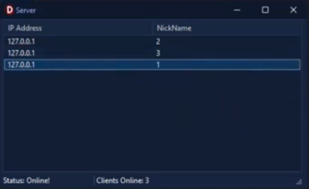

<h1>Delphi Client-Server Communication Project Utilizing Netcom7 Socket Library</h1>

This Delphi VCL application demonstrates a basic client-server communication setup using the <code>ncSockets</code> library. It allows the server to accept multiple clients, broadcast messages to all connected clients, and send messages to specific clients.

<!-- Replace 'screenshot.png' with the path to your actual image file -->

  

<h2>Features</h2>
<ul>
  <li><strong>Server Management:</strong> Handles multiple client connections and disconnections.</li>
  <li><strong>Broadcast Messaging:</strong> Sends messages to all connected clients.</li>
  <li><strong>Targeted Messaging:</strong> Sends messages to a specific client.</li>
  <li><strong>Client List Management:</strong> Displays connected clients in a <code>TListView</code>.</li>
</ul>

<h2>Components</h2>
<ul>
  <li><code>TncServerSource:</code> Manages server socket communications.</li>
  <li><code>TListView:</code> Displays the list of connected clients.</li>
  <li><code>TStatusBar:</code> Shows the server status and connection count.</li>
  <li><code>TPopupMenu:</code> Provides options for broadcasting or sending messages to selected clients.</li>
</ul>

<h2>Usage</h2>
<ol>
  <li><strong>Start the Application:</strong> Run the Delphi project to start the server.</li>
  <li><strong>Connect Clients:</strong> Clients can connect to the server using the specified port (3434).</li>
  <li><strong>Broadcast Message:</strong> Use the context menu option <code>S1</code> to send a message to all connected clients.</li>
  <li><strong>Send to Selected Client:</strong> Use the context menu option <code>S2</code> to send a message to a specific client selected from the <code>TListView</code>.</li>
</ol>

<h2>Dependencies</h2>
<ul>
  <li><code>Delphi RAD Studio:</code> Required for compiling and running the project.</li>
  <li><code>ncSockets library (NetCom7): <a href="https://github.com/DelphiBuilder/NetCom7" target="_blank">https://github.com/DelphiBuilder/NetCom7</a></code> Essential for socket communication functionality.</li>
</ul>

<h2>License</h2>

This project is provided "as is", without warranty of any kind.

Built with Delphi RAD Studio with ❤️ by Bitmasterxor.

